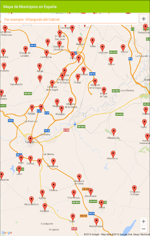
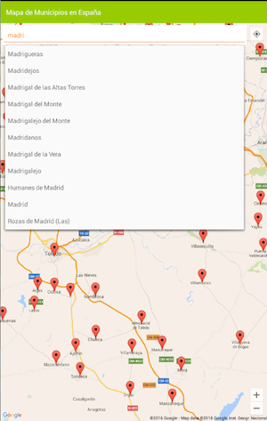
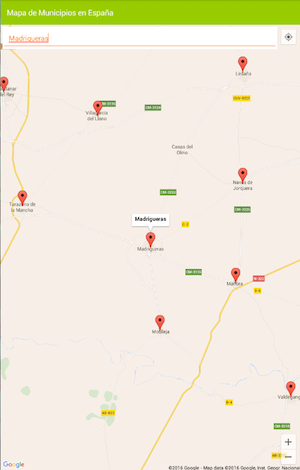
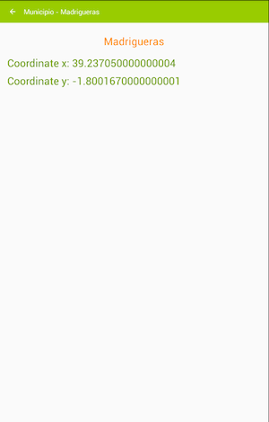

# Municipios de España - Maps Example
App with an example of Map use and different features.

- AutocompleteTextView for searching any location
- MyLocation enable
- Use of Map markers
- Use of XML resources to represent the different locations

